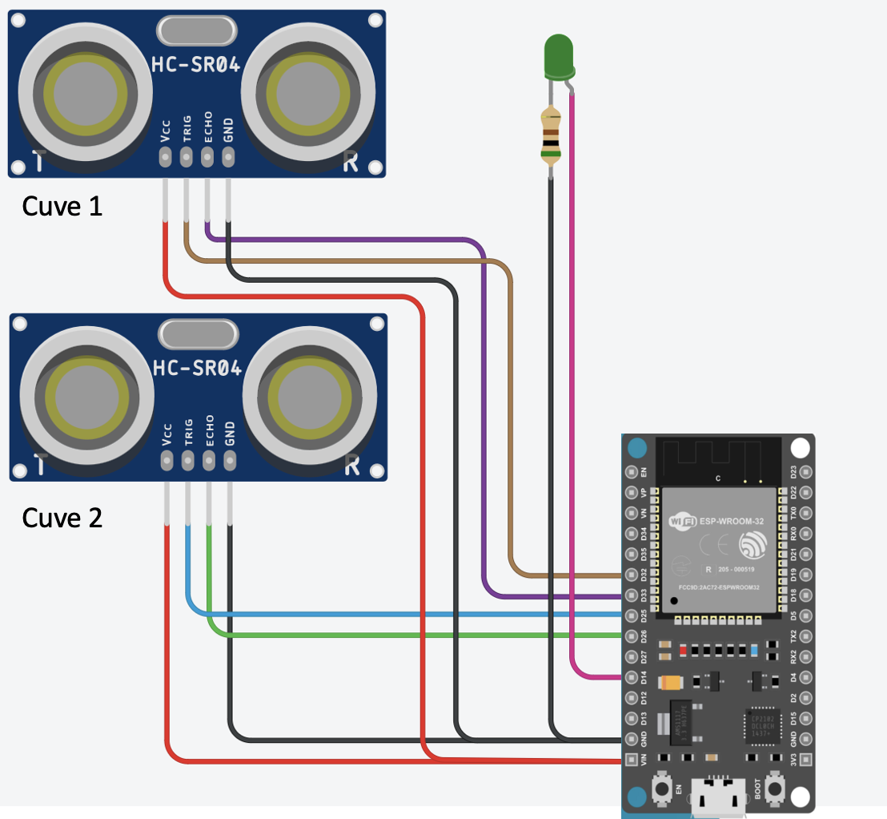

# Projet de Surveillance du Niveau de Cuve avec ESP32

Ce projet utilise un ESP32 pour mesurer le niveau de l'eau dans deux cuves à l'aide de capteurs ultrasoniques HC-SR04. Les données mesurées sont envoyées à un serveur via une requête POST. Une LED est allumée lorsque l'ESP32 est connecté au WiFi.

## Matériel Requis

- 1x ESP32 Dev Module
- 2x Capteurs ultrasoniques HC-SR04
- 1x LED
- 1x Résistance de 330 ohms (pour la LED)
- Câbles de connexion

## Configuration du Circuit

1. Connectez les capteurs HC-SR04 à l'ESP32:
   - VCC vers 5V
   - GND vers GND
   - TRIG vers les broches définies dans le code (GPIO 32 et 25)
   - ECHO vers les broches définies dans le code (GPIO 33 et 26)
2. Connectez la LED à l'ESP32:
   - Anode (côté long) vers GPIO 12 (ou une autre broche GPIO disponible)
   - Cathode (côté court) vers GND à travers une résistance de 330 ohms

    

## Installation

1. Assurez-vous que l'IDE Arduino est installé sur votre ordinateur.
2. Connectez votre ESP32 à votre ordinateur via un câble USB.
3. Ouvrez le fichier `.ino` avec l'IDE Arduino.
4. Installez les bibliothèques nécessaires via le gestionnaire de bibliothèques de l'IDE Arduino :
   - WiFi.h
   - HCSR04.h
5. Modifiez les variables `ssid` et `password` avec vos propres informations réseau.
6. Sélectionnez le bon port COM et le modèle de carte ESP32 dans l'IDE Arduino.
7. Téléversez le code sur votre ESP32.

## Utilisation

Une fois le code téléversé et le circuit configuré, l'ESP32 tentera de se connecter au réseau WiFi spécifié. La LED s'allumera pour indiquer que la connexion est établie. L'ESP32 mesurera ensuite le niveau de l'eau dans les cuves à intervalles réguliers et enverra les données au serveur.

**Projet réalisé par Eliott EMPTAZ**. Pour toute question ou feedback, contactez-moi à eliott.emptaz.24@eigsi.fr.